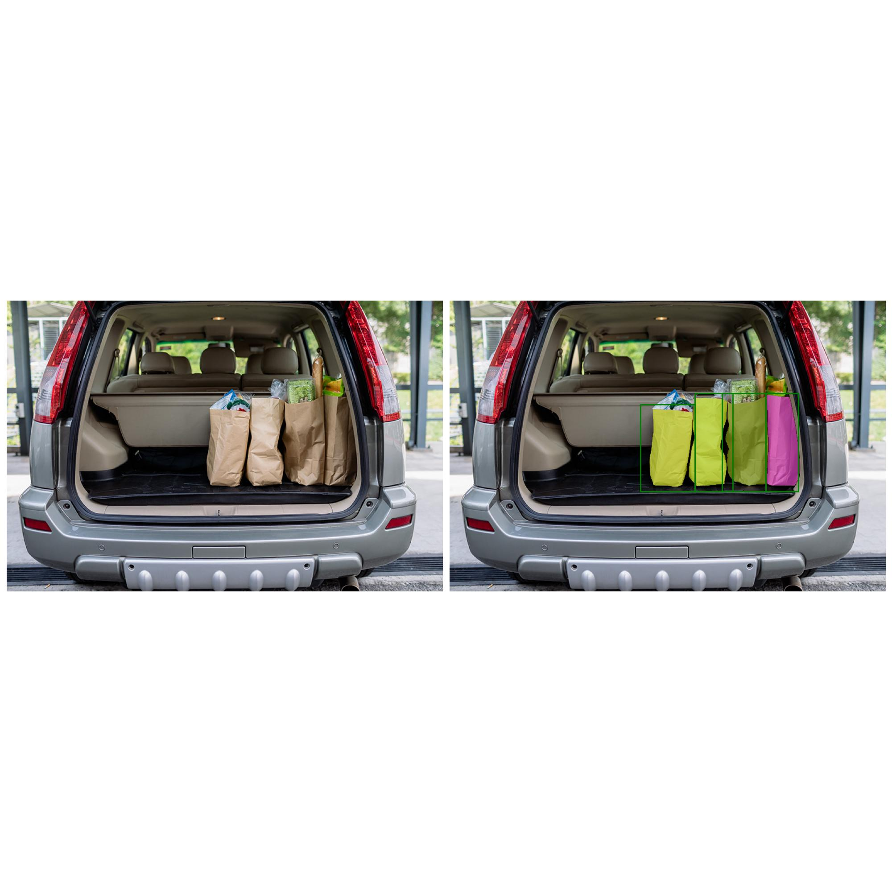

### Facebook's SAM model to segment masks of an object

In object detection, objects are often represented by bounding boxes, which are like drawing a rectangle around the object. These rectangles give a general idea of the object's location, but they don't show the exact shape of the object. They may also include parts of the background or other objects inside the rectangle, making it difficult to separate objects from their surroundings.
Segmentation masks, on the other hand, are like drawing a detailed outline around the object, following its exact shape. This allows for a more precise understanding of the object's shape, size, and position.

To use Segment Anything on a local machine, we'll follow these steps:

1) Set up a Python environment
2) Load the Segment Anything Model (SAM)
3) Generate masks automatically with SAM
4) Plot masks onto an image with Supervision
5) Generate bounding boxes from the SAM results

### Visulaization
Run demofile.py to visualize the results

Reference - https://github.com/facebookresearch/segment-anything/tree/main

_author : ju7stritesh@gmail.com_